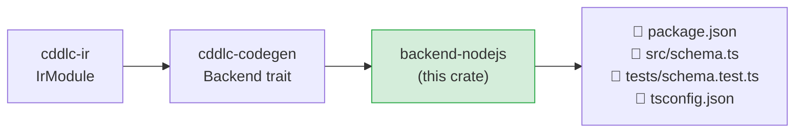

# backend-nodejs

Generates a complete TypeScript 5 / Node.js library — `package.json`, source `.ts` files,
and Jest tests — from an `IrModule`.  The generated code targets modern ESM Node.js and uses
[cborg](https://www.npmjs.com/package/cborg) for CBOR and the built-in `JSON` global for JSON.

## Position in the pipeline



## Generated output layout

```
<output>/
  package.json             # ESM package; deps: cborg; devDeps: jest, ts-jest, typescript
  tsconfig.json            # strict TypeScript 5 config targeting ES2022
  src/
    <module>.ts            # all types with encode/decode functions
  tests/
    <module>.test.ts       # Jest roundtrip tests for every type
```

## Runtime

| Format | Runtime library |
|---|---|
| CBOR (default) | [cborg](https://www.npmjs.com/package/cborg) — pure-JS RFC 8949 encoder/decoder |
| JSON | Built-in `JSON.stringify` / `JSON.parse` |

## What is generated per IR type

### Structs

```typescript
export interface Device {
    id:     string;
    active: boolean;
    label?: string;             // optional field — undefined if absent
}

export function encodeDevice(v: Device): Uint8Array { … }   // CBOR
export function decodeDevice(data: Uint8Array): Device { … }

export function deviceToJson(v: Device): object { … }       // JSON
export function deviceFromJson(o: unknown): Device { … }
```

- Optional fields use TypeScript optional properties (`?`).
- CBOR maps use string keys by default; integer keys are used when the CDDL schema
  specifies them.
- JSON encode/decode uses plain object literals — no external serialization library.

### Enums

```typescript
export type Status = "ok" | "warn" | "error";   // string enum
export type Priority = 1 | 2 | 3;              // integer enum

export function encodeStatus(v: Status): Uint8Array { … }
export function decodeStatus(data: Uint8Array): Status { … }
```

### Arrays

```typescript
export type Readings = number[];

export function encodeReadings(v: Readings): Uint8Array { … }
export function decodeReadings(data: Uint8Array): Readings { … }
```

### Aliases

```typescript
export type DeviceId = string;
```

## Supported serialization formats

| `--format` | Generated functions |
|---|---|
| `cbor` (default) | `encode<T>` / `decode<T>` returning `Uint8Array` |
| `json` | `<T>ToJson` / `<T>FromJson` using plain JS objects |

## Install and test generated code

```bash
cd <output>/
npm install
npm test          # runs Jest tests
npm run build     # compiles TypeScript → dist/
```

Requires Node.js 18+ and npm.

## Known gaps and future enhancements

- **Partial constraint validation**: `.size` string-length checks are emitted; numeric
  range checks and `.regexp` validation are not yet emitted in the generated TypeScript.
- **No ESLint / Prettier config**: the generated project has no linting or formatting
  configuration.
- **`any` typed fields**: `any`-typed CDDL fields generate TypeScript `unknown` (or
  occasionally `any`) — narrowing these with discriminated unions would improve type safety.
- **No `@doc` as JSDoc comments**: doc pragmas are not rendered as `/** … */` JSDoc blocks.
- **Browser bundle**: the generated code is Node.js-centric (uses `Buffer`, Node ESM);
  a browser-compatible build would require a bundler config (esbuild / rollup).
- **No interop harness for Dart**: the `--interop-langs` list does not include `dart`,
  so cross-language roundtrip tests between Node.js and Dart are not generated.
- **cborg version**: the generated `package.json` pins a specific cborg version; version
  drift can break fresh installs.

## License

MIT OR Apache-2.0
